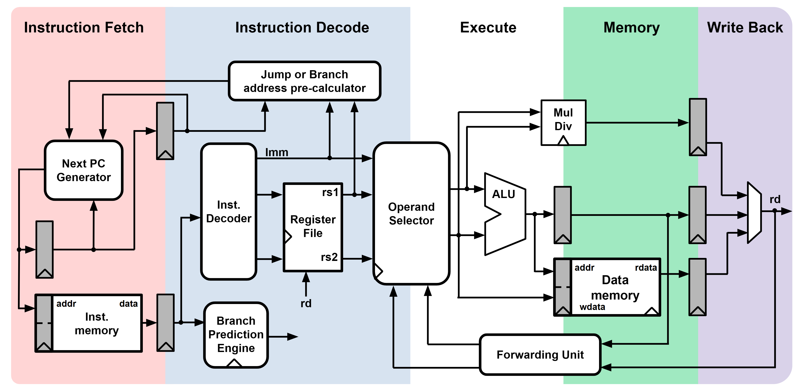

Arcabuco-SV Project
================
Arcabuco-SV is a public implementation of the RISC-V-IM core, replicating the core architected and designed during my thesis project but using System Verilog.

### Core Features
- RISC-V IM
- 5 Pipeline Stages
- Branch Prediction
- Forward Unit
- Scratchpad Memory
- Instruction Access Interface
- Data Access Interface
